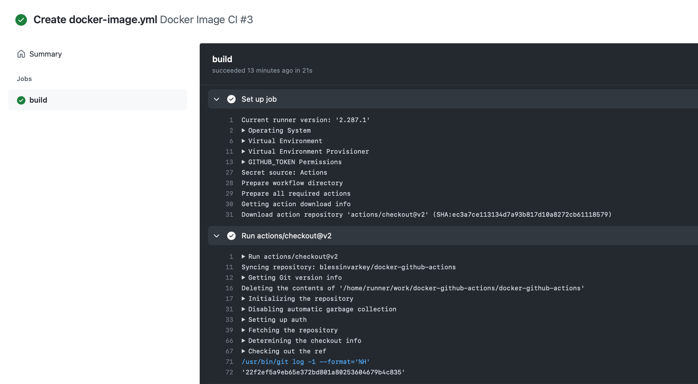
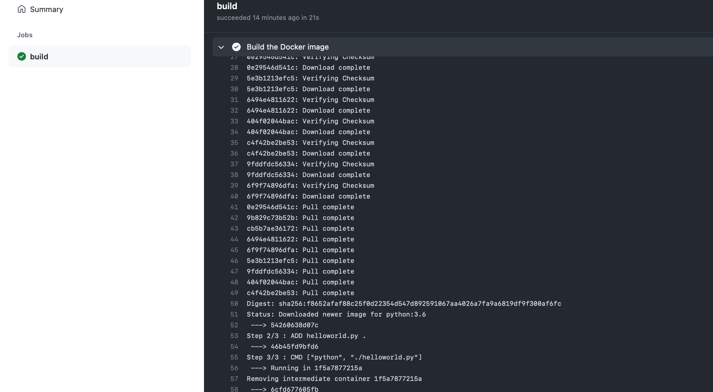

# docker

## Setting up the dockerfile
- Create a new file: [helloworld.py](main/helloworld.py)
- Create a [Dockerfile](main/Dockerfile)

## Setting up the CI/CD Pipeline 
- Create a new workflow or select the docker template
- Ammend the .yml page.
    - on push: only for the main branch
    - runs-on: ubuntu latest vm 
    - actions/checkout: specific github action + specific version


```
name: Docker Image CI

on:
  push:
    branches: [ main ]
  pull_request:
    branches: [ main ]

jobs:

  build:

    runs-on: ubuntu-latest

    steps:
    - uses: actions/checkout@v2
    - name: Build the Docker image
      run: docker build . --file Dockerfile --tag hello
```



