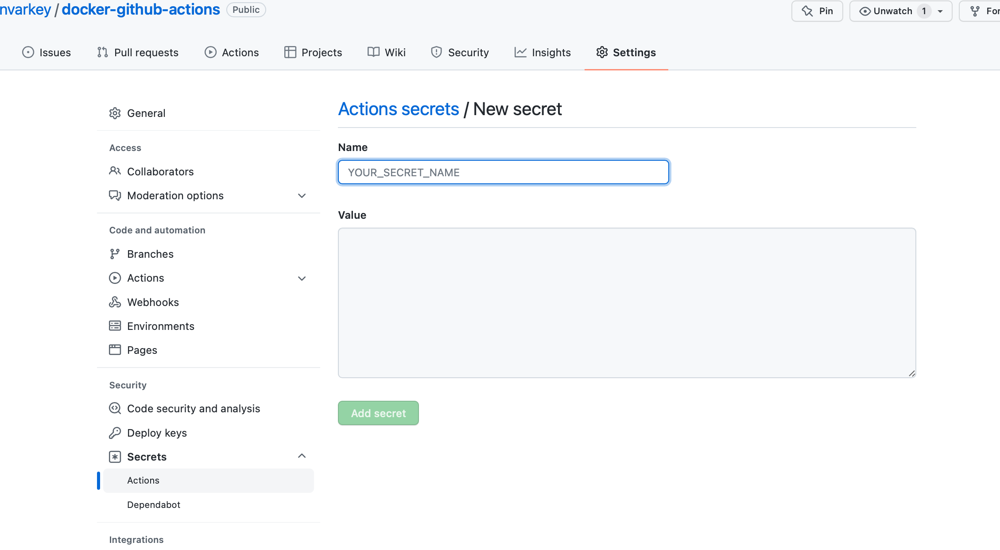
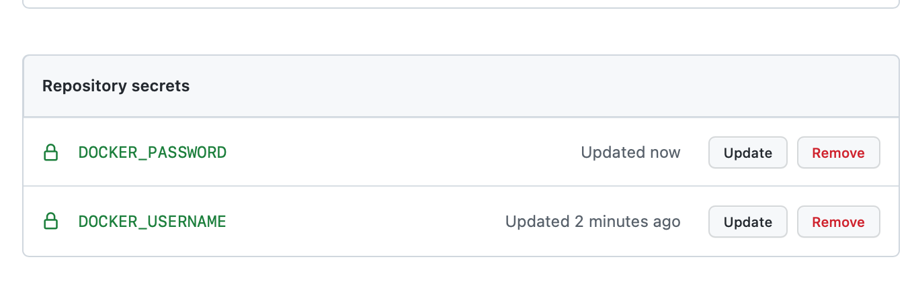

# docker

## Setting up the dockerfile
- Create a new file: [helloworld.py](main/helloworld.py)
- Create a [Dockerfile](main/Dockerfile)

## Setting up the CI/CD Pipeline 
- Create a new workflow or select the docker template
- Ammend the .yml page. It can be found in .github/workflows folder.
    - _on push:_ Triggers the event (only on the main branch)
    - _runs-on:_ ubuntu latest vm 
    - _actions/checkout:_ specific github action + specific version


```
name: Docker Image CI

on:
  push:
    branches: [ main ]
  pull_request:
    branches: [ main ]

jobs:

  build:

    runs-on: ubuntu-latest

    steps:
    - uses: actions/checkout@v2
    - name: Build the Docker image
      run: docker build . --file Dockerfile --tag hello
```


## To build and push docker image

Create a [repo](https://hub.docker.com/repository/docker/blessinvarkey/docker-github-actions) on hub.docker.com.

Update .yml file with [Docker Build and Push Action](https://github.com/marketplace/actions/docker-build-push-action)

```
name: Docker Image CI

on:
  push:
    branches: [ main ]
  pull_request:
    branches: [ main ]

jobs:

  build:

    runs-on: ubuntu-latest

    steps:
    - uses: actions/checkout@v2
    - name: Build the Docker image
      run: docker build . --file Dockerfile --tag hello
    - uses: mr-smithers-excellent/docker-build-push@v5
      name: Build & push Docker image
      with:
        image: repo/image
        tags: v1, latest
        registry: registry-url.io
        dockerfile: Dockerfile.ci
        username: ${{ secrets.DOCKER_USERNAME }}
        password: ${{ secrets.DOCKER_PASSWORD }}

    
```
## Set Secrets


 
Create two secret keys: DOCKER_USERNAME and DOCKER_PASSWORD. The values should be your hub.docker.com username and password, respectively. 


